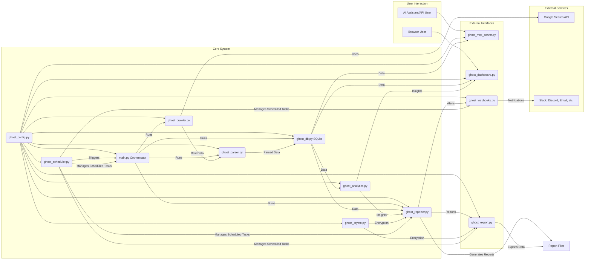

# GHOST DMPM - Discreet MVNO Policy Mapper


## 🎯 Overview
The GHOST Protocol Discreet MVNO Policy Mapper (DMPM) is an automated intelligence gathering system designed to continuously map the US Mobile Virtual Network Operator (MVNO) landscape. It identifies and ranks MVNOs based on their perceived leniency regarding prepaid SIM card identity verification and the ease of anonymous acquisition. The system operates with a minimal digital footprint, optimizing for data freshness and relevance, and aims to provide actionable intelligence for privacy-conscious users and security researchers.

Key use cases include:
- Identifying MVNOs with low barriers to anonymous SIM card activation.
- Tracking policy changes related to identity verification across various MVNOs.
- Supporting research into MVNO operational security and privacy practices.
- Providing data for risk assessment in scenarios requiring untraceable communications.

## 🚀 Quick Start

Get GHOST DMPM up and running in three simple steps:

1.  **Clone the Repository:**
    ```bash
    git clone https://github.com/username/ghost-dmpm.git # Replace username/ghost-dmpm with the actual repository path
    cd ghost-dmpm
    ```
2.  **Launch with Docker Compose:**
    ```bash
    docker-compose up --build -d
    ```
3.  **Explore the Dashboard:**
    Open your web browser and go to `http://localhost:5000`.
    (Default login: `commander` / `ghost_protocol_2024` - It's crucial to change these in `config/ghost_config.json` or `ghost_dashboard.py` for any non-testing use!)

This sequence starts all GHOST DMPM services, including the web dashboard and the MCP server for AI integration. The system will automatically initiate its first intelligence gathering cycle using default settings.

## ✨ Features
The GHOST DMPM system offers a comprehensive suite of features for MVNO policy intelligence:

-   **Real-time MVNO Policy Tracking**: Continuously gathers and updates information on MVNO policies using automated web crawling.
-   **Leniency Scoring Algorithm**: Ranks MVNOs based on a configurable algorithm that assesses the ease of anonymous SIM acquisition.
-   **Natural Language Queries via MCP**: Interact with the system using natural language through the Model Context Protocol (MCP) server, enabling AI assistant integration.
-   **AI Assistant Integration**: Designed for easy integration with AI platforms like OpenAI, Claude, and Gemini. See [AI Integration Guide](docs/Integration.md).
-   **Automated Alerts and Reporting**: Generates regular intelligence briefs and can be configured for real-time alerts on significant policy changes.
-   **Predictive Analytics**: Employs analytics to forecast potential policy shifts and identify emerging trends (via `ghost_analytics.py`).
-   **Multi-format Exports**: Export gathered intelligence and reports in various formats including CSV, JSON, and PDF (via `ghost_export.py`).
-   **Webhook Notifications**: Send alerts and updates to Slack, Discord, Email, and MS Teams (via `ghost_webhooks.py`).
-   **Scheduled Operations**: Automate intelligence cycles, report generation, and notifications using a flexible scheduler (via `ghost_scheduler.py`).
-   **Modular Design**: Core components (crawler, parser, reporter, database, dashboard, analytics, webhooks, export, scheduler) are built as distinct Python modules for flexibility and scalability.
-   **Data Persistence**: Stores processed MVNO data, policy changes, and crawl history in an SQLite database.
-   **Encrypted Reporting**: Option to generate intelligence reports in an encrypted format.
-   **Web Dashboard**: Provides a Flask-based web interface to view key findings, system status, and manage operations.
-   **Dockerized Deployment**: Includes Dockerfile and `docker-compose.yml` for easy, consistent, and secure deployment.
-   **Security Conscious**: Emphasizes secure API key handling, encrypted outputs, and provides security guidelines.

## 📊 Live Demo

Below are some examples of GHOST DMPM in action.

**GHOST Dashboard - MVNO Leniency Overview:**
```
[Screenshot of the GHOST Dashboard Web UI will be placed here. It typically shows a table of MVNOs, their leniency scores, last update times, and key policy points. Users can sort and filter this data for quick insights.]
```
*Caption: The GHOST Dashboard provides a visual overview of MVNO leniency scores, recent policy changes, and system status. Access it at `http://localhost:5000`.*

**Example Full Cycle Run (`python main.py`):**
```bash
$ python main.py
======================================================================
GHOST PROTOCOL - DISCREET MVNO POLICY MAPPER
======================================================================

[*] Initializing configuration...
[*] Feature Status:
    - Encryption: ENABLED
    - NLP: ENABLED
    - API Mode: MOCK

[*] Phase 1: Initiating web crawl...
    - Crawled 5 MVNOs

[*] Phase 2: Parsing intelligence...
    - Extracted policies from 5 MVNOs

[*] Phase 3: Storing intelligence...
    - Stored 0 new/updated policies

[*] Phase 4: Generating intelligence report...

[*] OPERATION COMPLETE
    - Duration: 41.60 seconds (example time)
    - Top MVNO: Mint Mobile (example)
    - Reports saved to: reports/
    - Raw data saved to: test_output/

======================================================================
```
*Caption: Output from a full intelligence gathering cycle. The system crawls, parses, stores, and reports on MVNO data. Timings and specific MVNO counts may vary.*

**MCP Client Query Example (`src/ghost_dmpm/api/mcp_client.py`):**
```bash
$ python src/ghost_dmpm/api/mcp_client.py --method get_top_mvnos --params '{"n": 3}'
Attempting to connect to MCP server and run tests...
[✓] Connected to GHOST MCP Server

[*] Calling method: get_top_mvnos with params: {'n': 3}
{
  "timestamp": "2025-07-03T11:32:52.619554", # Example timestamp
  "id": "get_top_mvnos_1751542372.618338",    # Example ID
  "result": {
    "mvnos": [
      {
        "rank": 1,
        "name": "Mint Mobile",
        "score": 3.3,
        "assessment": "LENIENT - Basic verification only",
        "last_updated": "2025-07-03T11:12:48.129570" # Example timestamp
      },
      {
        "rank": 2,
        "name": "US Mobile",
        "score": 3.3,
        "assessment": "LENIENT - Basic verification only",
        "last_updated": "2025-07-03T11:12:48.141945" # Example timestamp
      },
      {
        "rank": 3,
        "name": "Visible",
        "score": 3.3,
        "assessment": "LENIENT - Basic verification only",
        "last_updated": "2025-07-03T11:12:48.146843" # Example timestamp
      }
    ],
    "total_count": 3
  }
}
Connection closed.
```
*Caption: Real output from querying the MCP server for the top 3 lenient MVNOs. This demonstrates direct API interaction for automated data retrieval.*

## 🏗️ Architecture
The GHOST DMPM system is designed as a modular pipeline. Configuration is centralized, and components interact through well-defined interfaces, primarily exchanging data via JSON files and an SQLite database.


*Caption: System components and data flow in GHOST DMPM.*

Further details on architecture, data flow, and database schema can be found in the original README sections, which will be migrated to `docs/Architecture.md` or similar.

## 📦 Installation
GHOST DMPM can be installed manually or deployed using Docker. Docker is recommended for ease of use and consistency.

### Prerequisites
*   Python 3.9+
*   Docker & Docker Compose (for Docker deployment)
*   Git
*   Build essentials (e.g., `build-essential python3-dev` on Debian)
*   (Optional) Access to Google Search API for `live` mode.

### Option 1: Docker (Recommended)
This is the quickest and most reliable way to get GHOST DMPM running.

1.  **Clone the repository:** (If not already done)
    ```bash
    git clone <your-repository-url>
    cd ghost-dmpm
    ```
2.  **Build and start services:**
    ```bash
    docker-compose up --build -d
    ```
3.  **Access:**
    *   Dashboard: `http://localhost:5000`
    *   MCP Server: `ws://localhost:8765`
4.  **Stop services:**
    ```bash
    docker-compose down
    ```

### Option 2: Manual Installation
1.  **Clone and set up environment:**
    ```bash
    git clone <your-repository-url>
    cd ghost-dmpm
    python3 -m venv venv
    source venv/bin/activate
    ```
2.  **Install dependencies:**
    ```bash
    pip install -r requirements.txt
    ```
3.  **Initialize Configuration and Directories:**
    ```bash
    mkdir -p data logs reports test_output config templates
    # Run python ghost_config.py to generate default config if needed
    ```
4.  **Run application components as needed:**
    *   `python main.py` (Full cycle)
    *   `python ghost_dashboard.py` (Dashboard)
    *   `python ghost_mcp_server.py` (MCP Server)


### Option 3: Cloud Deployment
Guidance for deploying to cloud platforms like AWS, GCP, and Azure will be provided in future documentation.

## 🔧 Configuration
GHOST DMPM is configured via `config/ghost_config.json`. A default configuration is generated if it doesn't exist.
Refer to `ghost_config.py` and the generated `config/ghost_config.json` for all options.

**Key Sections:**
*   `mvno_list`, `keywords`
*   `google_search_mode`, `api_keys` (Use environment variables for production secrets!)
*   `crawler`, `parser`, `database`
*   `dashboard` (Change default credentials!)
*   `logging`, `reports`
*   `webhooks`, `export`, `scheduler`, `analytics`

**Security Note:** For production, use environment variables for sensitive data like API keys and passwords rather than storing them directly in `ghost_config.json`.

## 📖 Usage Guide

### Basic Usage (Full Cycle)
```bash
python main.py
```
Output and logs are generated in respective directories (`reports/`, `logs/`, `data/`, `test_output/`).

### Natural Language Queries (via MCP)
1.  Start MCP server: `python ghost_mcp_server.py` (or via Docker Compose).
2.  Use `mcp_client.py`:
    ```bash
    python mcp_client.py --method get_top_mvnos --params '{"n": 5}'
    ```
    See `MCP_QUICKSTART.md` or [AI Integration Guide](docs/Integration.md).

### API Integration
-   **Direct Module Usage**: Import classes like `GhostCrawler` in Python.
-   **MCP Server**: Connect via WebSocket.
-   **Dashboard API**: RESTful endpoints (see `ghost_dashboard.py`).

### Webhook Setup
Configure in `config/ghost_config.json` under `webhooks`. Example:
```json
"webhooks": {
  "slack_url": "YOUR_SLACK_WEBHOOK_URL",
  "email": { "smtp_server": "smtp.example.com", "smtp_user": "user" /* ... */ }
}
```
See `examples/webhook_setup.py`.

### Scheduled Reports
Configure in `config/ghost_config.json` under `scheduler.jobs`. Example:
```json
"scheduler": {
  "enabled": true,
  "jobs": [{ "name": "daily_brief", "cron_schedule": "0 2 * * *" /* ... */ }]
}
```
See `examples/automated_reports.py`.

## 🤖 AI Integration
GHOST DMPM integrates with AI platforms (OpenAI, Claude, Gemini) via the **Model Context Protocol (MCP) Server** (`ghost_mcp_server.py`).
This WebSocket server allows AI assistants to retrieve data and insights.

➡️ **Detailed Guide: [docs/Integration.md](docs/Integration.md)**

## 📡 API Reference
Comprehensive API documentation for modules:
➡️ **[docs/API_Reference.md](docs/API_Reference.md)**

**Key MCP Server Methods (Summary):**
| Method                | Description                     |
|-----------------------|---------------------------------|
| `authenticate`        | Authenticate client             |
| `get_top_mvnos`       | Get top N lenient MVNOs         |
| `search_mvno`         | Search for an MVNO's details    |
| `get_recent_alerts`   | Get recent policy changes       |
| `get_mvno_trend`      | Get historical score trend      |
| `get_system_status`   | Get GHOST system status         |
| `trigger_export`      | Request data export             |
| `get_analytics_insight`| Get analytical insight          |

## 🔍 Examples
Working code examples:
➡️ **[examples/](examples/)** directory.
- `basic_usage.py`
- `ai_integration/` (OpenAI, Claude, Gemini examples)
- `webhook_setup.py`
- `automated_reports.py`
- `advanced_analytics.py`
- `custom_export.py`

## 📈 Performance
Performance depends on network, targets, and resources.
Specific benchmark data will be added here once available.

**Optimization Tips:**
- Adjust crawler delays (`crawler.delay_base`).
- Use appropriate log levels (`INFO` for production).
- For more, see [docs/Performance_Tuning.md](docs/Performance_Tuning.md).

## 🛠️ Troubleshooting
Common issues and solutions.
- Installation: Check Python version, build tools.
- Configuration: Validate `config/ghost_config.json`.
- API Keys: Verify keys and quotas for `live` mode.
- Dashboard: Check server status, credentials.

➡️ **Comprehensive Guide: [docs/Troubleshooting.md](docs/Troubleshooting.md)**

## 🤝 Contributing
We welcome contributions to GHOST DMPM! Whether you're fixing a bug, adding a feature, or improving documentation, your help is valued.

To contribute:
1.  **Fork the repository** and create a new branch for your feature or bug fix:
    ```bash
    git checkout -b feature/your-feature-name
    ```
2.  **Develop your changes.** Adhere to the existing code style (PEP 8 for Python).
3.  **Add tests** for any new functionality or bug fixes. Ensure all tests pass.
4.  **Update documentation** if your changes affect user-facing aspects or the system architecture.
5.  **Commit your changes** with clear, descriptive commit messages. Consider using [Conventional Commits](https://www.conventionalcommits.org/).
6.  **Create a Pull Request** to the `main` branch. Clearly describe the changes you've made and why.

**Code of Conduct:**
All contributors are expected to adhere to a standard of professional and respectful conduct. Please be considerate in all interactions.

## 📄 License
GHOST DMPM is released under the **MIT License**.

This means you are free to:
- Use, copy, modify, merge, publish, distribute, sublicense, and/or sell copies of the Software.
- Permit persons to whom the Software is furnished to do so, subject to the following conditions:

The above copyright notice and this permission notice shall be included in all copies or substantial portions of the Software.

The software is provided "AS IS", without warranty of any kind, express or implied, including but not limited to the warranties of merchantability, fitness for a particular purpose and noninfringement. In no event shall the authors or copyright holders be liable for any claim, damages or other liability, whether in an action of contract, tort or otherwise, arising from, out of or in connection with the software or the use or other dealings in the software.
