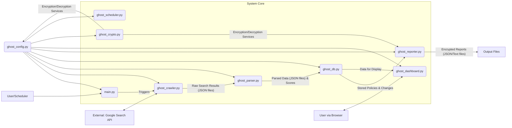

# GHOST Protocol Discreet MVNO Policy Mapper (DMPM)

[](https://shields.io/)
[](https://shields.io/)
[](LICENSE) <!-- Placeholder -->

The GHOST Protocol Discreet MVNO Policy Mapper (DMPM) is an automated intelligence gathering system designed to continuously map the US Mobile Virtual Network Operator (MVNO) landscape. It identifies and ranks MVNOs based on their perceived leniency regarding prepaid SIM card identity verification and the ease of anonymous acquisition, operating with a minimal digital footprint and optimizing for data freshness and relevance.

## Table of Contents

1.  [System Overview](#system-overview)
2.  [Features](#features)
3.  [Prerequisites](#prerequisites)
4.  [Installation](#installation)
    *   [Manual Installation](#manual-installation)
    *   [Docker-based Deployment](#docker-based-deployment)
5.  [Configuration](#configuration)
6.  [Usage](#usage)
    *   [Running the Full Cycle](#running-the-full-cycle)
    *   [Accessing the Dashboard](#accessing-the-dashboard)
7.  [Module Descriptions](#module-descriptions)
    *   [`ghost_config.py`](#ghost_configpy)
    *   [`ghost_crawler.py`](#ghost_crawlerpy)
    *   [`ghost_parser.py`](#ghost_parserpy)
    *   [`ghost_reporter.py`](#ghost_reporterpy)
    *   [`ghost_db.py`](#ghost_dbpy)
    *   [`ghost_dashboard.py`](#ghost_dashboardpy)
    *   [`ghost_crypto.py`](#ghost_cryptopy)
    *   [`ghost_scheduler.py`](#ghost_schedulerpy)
    *   [`main.py`](#mainpy)
8.  [System Architecture](#system-architecture)
    *   [Data Flow](#data-flow)
    *   [Database Schema](#database-schema)
9.  [Leniency Scoring Algorithm](#leniency-scoring-algorithm)
10. [Operational Procedures](#operational-procedures)
11. [Troubleshooting](#troubleshooting)
12. [Security Considerations](#security-considerations)
13. [Disk Space Requirements](#disk-space-requirements)
14. [Contributing Guidelines](#contributing-guidelines)
15. [License](#license)

---

## System Overview

The GHOST Protocol Discreet MVNO Policy Mapper (DMPM) is a modular Python-based system designed for automated intelligence gathering. Its primary purpose is to continuously monitor and analyze the policies of Mobile Virtual Network Operators (MVNOs) in the UnitedSstates, specifically focusing on aspects related to anonymous SIM card acquisition and identity verification requirements.

The system operates by:
1.  **Crawling**: Utilizing search engines (with a mock fallback for local testing and Google Search API for production) to find relevant information about MVNO policies from official websites, forums, and news articles.
2.  **Parsing**: Extracting key information, identifying policy-related keywords, and performing basic sentiment analysis on gathered data.
3.  **Scoring**: Applying a leniency scoring algorithm to rank MVNOs based on the ease of anonymous SIM acquisition.
4.  **Storing**: Persisting processed data and crawl statistics in a local database.
5.  **Reporting**: Generating intelligence briefs and providing a dashboard for visualizing the findings.

The architecture emphasizes modularity, allowing components to be updated or replaced independently. It is designed for deployment in Docker containers to ensure consistency across environments and to facilitate operational security.

## Features

*   **Automated MVNO Intelligence**: Continuously gathers and updates information on MVNO policies.
*   **Leniency Scoring**: Ranks MVNOs based on a configurable algorithm that assesses the ease of anonymous SIM acquisition.
*   **Modular Design**: Core components (crawler, parser, reporter, database, configuration) are built as distinct Python modules.
*   **Google Search API Integration**: Supports using the Google Search API for comprehensive data gathering (with a mock API for development/testing).
*   **Data Persistence**: Stores processed MVNO data and crawl history in an SQLite database.
*   **Encrypted Reporting**: Generates intelligence reports in an encrypted format.
*   **Web Dashboard**: Provides a Flask-based web interface to view key findings and system status (requires authentication).
*   **Configuration Management**: Centralized configuration for system parameters, API keys, and logging.
*   **Dockerized Deployment**: Includes Dockerfile and docker-compose.yml for easy and secure deployment.
*   **Extensible Keyword System**: Uses configurable lists of MVNOs and keywords for targeted searching.
*   **Temporal Obfuscation**: Incorporates delays in crawling patterns to minimize digital footprint (when using live API).
*   **Security Conscious**: Emphasizes secure API key handling, encrypted outputs, and provides security guidelines.

---

## Prerequisites

Before you begin, ensure you have the following installed and configured:

*   **Operating System**:
    *   Linux (Debian-based like Ubuntu, or RHEL-based like CentOS/Fedora recommended).
    *   macOS (with Homebrew for installing some dependencies might work but is not officially supported).
    *   Windows (via WSL2 - Windows Subsystem for Linux - is recommended if running directly on Windows).
*   **Python**:
    *   Version 3.9 or higher.
    *   `pip` (Python package installer).
    *   `venv` (for creating virtual environments, highly recommended).
*   **Docker (for containerized deployment)**:
    *   Docker Engine (latest stable version).
    *   Docker Compose (latest stable version).
*   **Git**: For cloning the repository.
*   **Build Essentials (for some Python packages)**:
    *   On Debian/Ubuntu: `sudo apt-get install build-essential python3-dev`
    *   On Fedora/RHEL: `sudo yum groupinstall "Development Tools"` and `sudo yum install python3-devel`
*   **Web Browser**: For accessing the GHOST Dashboard (e.g., Firefox, Chrome).

You can verify most of these using commands like:
```bash
python3 --version
pip --version
docker --version
docker-compose --version
git --version
```

## Installation

You can install and run the GHOST DMPM system either manually using Python's virtual environments or via Docker for a containerized setup.

### Manual Installation

1.  **Clone the Repository:**
    ```bash
    git clone <your-repository-url>
    cd ghost-dmpm # Or your repository's directory name
    ```
    *(Replace `<your-repository-url>` with the actual URL of the GHOST DMPM repository. If you have already cloned it, navigate to the project directory.)*

2.  **Create and Activate a Python Virtual Environment:**
    It's highly recommended to use a virtual environment to manage dependencies.
    ```bash
    python3 -m venv venv
    source venv/bin/activate
    ```
    On Windows, activation is `venv\\Scripts\\activate`.

3.  **Install Dependencies:**
    Install all required Python packages using `pip`.
    ```bash
    pip install -r requirements.txt
    ```
    If you encounter issues, ensure your `pip`, `setuptools`, and `wheel` are up-to-date:
    ```bash
    pip install --upgrade pip setuptools wheel
    ```
    Then, retry installing requirements.

4.  **Initialize Configuration (Optional First Run):**
    The system may create default configuration files on its first run or when specific modules are accessed. For example, running `python ghost_config.py` or `python main.py` might initialize a default `config/ghost_config.json`. Review the [Configuration](#configuration) section for more details.
    Ensure required directories exist (though most scripts create them if missing):
    ```bash
    mkdir -p data logs reports test_output config templates
    ```

5.  **Prepare Input Files (if not using defaults):**
    *   The system can be configured to use `mvnos.txt` and `keywords.txt`. If you intend to use custom lists, place them in the root directory or update their paths in the configuration.
    *   `mvnos.txt`: Contains target MVNOs, one per line.
    *   `keywords.txt`: Contains relevant search keywords, one per line.

### Docker-based Deployment

Docker provides a containerized environment for running GHOST DMPM, ensuring consistency and isolating dependencies.

**Option 1: Using Docker Compose (Recommended)**

Docker Compose simplifies the management of multi-container Docker applications. The provided `docker-compose.yml` file is configured to build the image and run the container with appropriate volume mounts for persistent data.

1.  **Build and Start the Container:**
    Navigate to the project's root directory (where `docker-compose.yml` is located) and run:
    ```bash
    docker-compose up --build -d
    ```
    *   `--build`: Forces Docker to build the image from the Dockerfile.
    *   `-d`: Runs the container in detached mode (in the background).

2.  **Accessing the Application:**
    *   The GHOST Dashboard should be accessible at `http://localhost:5000` (or the port you've mapped).
    *   Logs can be viewed using: `docker-compose logs -f ghost-dmpm` (or the service name defined in `docker-compose.yml`).
    *   Data, logs, reports, and configuration will be persisted in the local directories mapped in `docker-compose.yml` (e.g., `./data`, `./logs`).

3.  **Stopping the Container:**
    ```bash
    docker-compose down
    ```

**Option 2: Using Dockerfile Directly**

You can also build and run the Docker image manually.

1.  **Build the Docker Image:**
    Navigate to the project's root directory (where `Dockerfile` is located) and run:
    ```bash
    docker build -t ghost-dmpm-image .
    ```
    This command builds an image named `ghost-dmpm-image`.

2.  **Run the Docker Container:**
    ```bash
    docker run -d -p 5000:5000 \
      --name ghost-dmpm-container \
      -v "$(pwd)/data:/app/data" \
      -v "$(pwd)/logs:/app/logs" \
      -v "$(pwd)/reports:/app/reports" \
      -v "$(pwd)/test_output:/app/test_output" \
      -v "$(pwd)/config:/app/config" \
      -e PYTHONUNBUFFERED=1 \
      ghost-dmpm-image
    ```
    *   `-d`: Runs in detached mode.
    *   `-p 5000:5000`: Maps port 5000 of the container to port 5000 on your host.
    *   `--name ghost-dmpm-container`: Assigns a name to the container.
    *   The `-v` flags mount local directories into the container for persistent storage. Ensure these local directories (`data`, `logs`, `reports`, `test_output`, `config`) exist. Using `$(pwd)` ensures absolute paths are used for volumes.
    *   `-e PYTHONUNBUFFERED=1`: Ensures Python output is sent straight to logs, useful for `docker logs`.


3.  **Accessing the Application:**
    *   Dashboard: `http://localhost:5000`
    *   Logs: `docker logs -f ghost-dmpm-container`

4.  **Stopping and Removing the Container:**
    ```bash
    docker stop ghost-dmpm-container
    docker rm ghost-dmpm-container
    ```

**Docker Deployment Notes:**
*   The Docker image uses `python:3.9-slim` as a base.
*   The container runs a startup script (`/app/start.sh`) which initializes the application and starts the GHOST dashboard.
*   Review the `Dockerfile` and `docker-compose.yml` for specific configurations, such as environment variables and volume mounts. The `docker-compose.yml` also includes a healthcheck for the service.
*   **Standard vs. Minimal Deployment:** The current Docker setup provides a standard deployment. A "minimal" deployment option is not explicitly defined but could be achieved by customizing the Dockerfile (e.g., using a multi-stage build or removing development tools) if a smaller image size is critical for a specific production environment.

---

## Configuration

The GHOST DMPM system is configured primarily through a JSON file, managed by the `ghost_config.py` module. The default configuration path is `config/ghost_config.json`. If this file doesn't exist when the application first needs it, `GhostConfig` will create it with default values.

### Configuration File Structure

Here's an example of the default `config/ghost_config.json` structure:

```json
{
  "mvno_list": [
    "Mint Mobile",
    "US Mobile",
    "Visible",
    "Cricket Wireless",
    "Metro by T-Mobile"
  ],
  "keywords": [
    "no id required",
    "anonymous sim",
    "prepaid no id",
    "cash activation",
    "burner phone policy",
    "no ssn prepaid",
    "privacy sim"
  ],
  "google_search_mode": "mock", // "mock" or "live"
  "api_keys": {
    "google_search": "YOUR_GOOGLE_API_KEY_HERE (MOCK_KEY_IF_MODE_IS_MOCK)",
    "google_cx": "YOUR_GOOGLE_PROGRAMMABLE_SEARCH_ENGINE_ID_HERE (MOCK_CX_IF_MODE_IS_MOCK)"
  },
  "crawler": {
    "delay_base": 2.0, // Base delay in seconds between API calls
    "delay_variance": 0.15, // Percentage variance for delay (e.g., 0.15 for 15%)
    "timeout": 30, // Timeout for web requests in seconds
    "max_results_per_mvno": 10 // Max search results to process per MVNO
  },
  "parser": {
    "positive_keywords": ["easy", "no problem", "anonymous", "no id", "cash only"],
    "negative_keywords": ["requires id", "ssn needed", "credit check", "strict"]
  },
  "database": {
    "path": "data/ghost_data.db", // Path to the SQLite database file
    "encryption_enabled": false // Future feature: database-level encryption
  },
  "dashboard": {
    "host": "0.0.0.0", // Host for the web dashboard
    "port": 5000, // Port for the web dashboard
    "debug": false, // Flask debug mode for dashboard
    "username": "admin", // Default username for dashboard
    "password": "ghost2024" // Default password for dashboard - CHANGE THIS!
  },
  "logging": {
    "level": "INFO", // Logging level (DEBUG, INFO, WARNING, ERROR, CRITICAL)
    "directory": "logs",
    "filename_template": "ghost_{timestamp:%Y%m%d}.log"
  },
  "reports": {
    "directory": "reports",
    "top_n_mvnos": 10, // Number of top MVNOs to include in reports
    "encryption_enabled": true // Whether to encrypt report files
  }
}
```

**Key Configuration Options:**

*   `mvno_list`: A list of MVNO names to target for intelligence gathering.
*   `keywords`: A list of keywords used to generate search queries related to anonymous SIM acquisition.
*   `google_search_mode`: Set to `"mock"` to use the mock Google Search client (no real API calls, uses sample data). Set to `"live"` to use the actual Google Search API.
*   `api_keys`:
    *   `google_search`: Your Google API Key (if using `live` mode).
    *   `google_cx`: Your Google Programmable Search Engine ID (if using `live` mode).
*   `crawler`: Settings for the web crawler module, including request delays, timeouts, and result limits.
*   `parser`: Keywords for basic sentiment/policy analysis.
*   `database`: Configuration for the SQLite database.
*   `dashboard`: Settings for the web dashboard, including host, port, and **default credentials**.
*   `logging`: Logging level and output directory.
*   `reports`: Report output directory and settings.

### API Key Management

**IMPORTANT SECURITY NOTICE:**

*   **Never commit your actual API keys directly into `config/ghost_config.json` if your repository is public or shared.**
*   The system defaults to `"mock"` mode for Google Search, which does not require real API keys.
*   If you switch to `"live"` mode:
    1.  Obtain your Google API Key and Programmable Search Engine ID (CX) from the Google Cloud Console.
    2.  It is recommended to set API keys via environment variables or a secure vault system in production.
    3.  If you must place them in `config/ghost_config.json` for a private/local setup:
        *   Ensure the `config/` directory is in your `.gitignore` file (it usually is by default for configuration files).
        *   Restrict file permissions on `config/ghost_config.json` so only authorized users can read it.

**Setting API Keys (Example):**

You can manually edit `config/ghost_config.json` (while being mindful of the security risks) or use a script to update it. The `ghost_config.py` module itself provides methods to get/set configuration values, which could be used programmatically.

For Docker deployments, you can also pass API keys as environment variables and modify `ghost_config.py` or a startup script to read them from the environment and populate the configuration at runtime. See `docker-compose.yml` for examples of setting environment variables.

Example: If `ghost_config.py` is modified to read `GOOGLE_API_KEY` and `GOOGLE_CX_ID` environment variables:
```yaml
# In docker-compose.yml
services:
  ghost-dmpm:
    # ...
    environment:
      - GOOGLE_API_KEY=your_actual_google_api_key
      - GOOGLE_CX_ID=your_actual_google_cx_id
      - GHOST_SEARCH_MODE=live # To activate live mode
    # ...
```
*(Note: The current `ghost_config.py` would need modification to directly use environment variables for API keys in this manner; the above is illustrative of a common pattern.)*

The `GhostConfig` class in `ghost_config.py` handles loading this JSON file. When the application starts, it reads this configuration. You can modify values and restart the application for them to take effect.

### Initial Configuration

If `config/ghost_config.json` does not exist, running `python ghost_config.py` (or any script that initializes `GhostConfig`) will create it with default values. You should review and customize it according to your needs, especially the API keys if using live mode and the dashboard credentials.

**SECURITY WARNING:** The default dashboard credentials (`admin`/`ghost2024`) are insecure and **MUST be changed** before deploying in any non-testing environment. Update these in your `config/ghost_config.json`.

---

## Usage

The GHOST DMPM system can be operated in a few ways, primarily by running the main intelligence cycle script or by interacting with the web dashboard.

### Running the Full Intelligence Cycle

The `main.py` script orchestrates the complete intelligence gathering process: configuration loading, crawling, parsing, database storage, and report generation.

1.  **Ensure Configuration:**
    Verify your `config/ghost_config.json` is set up correctly, especially the `google_search_mode` and API keys if using `"live"` mode. See the [Configuration](#configuration) section.

2.  **Activate Virtual Environment (if installed manually):**
    ```bash
    source venv/bin/activate
    ```

3.  **Run the Script:**
    ```bash
    python main.py
    ```

**Expected Output from `main.py`:**

The script will print status messages to the console for each phase:
```
======================================================================
GHOST PROTOCOL - DISCREET MVNO POLICY MAPPER
======================================================================

[*] Initializing configuration...
[*] Feature Status:
    - Encryption: ENABLED
    - NLP: REGEX MODE
    - API Mode: MOCK

[*] Phase 1: Initiating web crawl...
    - Crawled X MVNOs

[*] Phase 2: Parsing intelligence...
    - Extracted policies from Y MVNOs

[*] Phase 3: Storing intelligence...
    - Stored Z new/updated policies

[*] Phase 4: Generating intelligence report...

[*] OPERATION COMPLETE
    - Duration: XX.YY seconds
    - Top MVNO: Some MVNO Name
    - Reports saved to: reports/
    - Raw data saved to: test_output/ (or as configured)

======================================================================
```
*   Log files will be generated in the `logs/` directory (e.g., `logs/ghost_YYYYMMDD.log`).
*   Raw crawled data (JSON) will be saved, typically in `test_output/` if `main.py` is run directly, or in the configured output directory.
*   Parsed data (JSON) will also be saved in a similar location.
*   Encrypted intelligence reports will be placed in the `reports/` directory.
*   Data will be stored/updated in the SQLite database (`data/ghost_data.db` by default).

### Accessing the Dashboard

The GHOST DMPM system includes a web-based dashboard (`ghost_dashboard.py`) for monitoring system status, viewing top MVNOs, recent alerts, and other intelligence.

1.  **Start the Dashboard:**
    *   **If using Docker Compose:** The dashboard is typically started automatically when you run `docker-compose up`.
    *   **If using Docker manually:** The `start.sh` script within the Docker container (used in the example `docker run` command) starts the dashboard.
    *   **If running manually:**
        ```bash
        source venv/bin/activate # If not already active
        python ghost_dashboard.py
        ```

2.  **Open in Browser:**
    Access the dashboard by navigating to `http://localhost:5000` (or the host and port configured in `config/ghost_config.json` or your Docker port mapping).

3.  **Authentication:**
    You will be prompted for a username and password.
    *   Default username: `admin` (or `commander`)
    *   Default password: `ghost2024` (or `ghost_protocol_2024`)
    *   *(Refer to your `config/ghost_config.json` or `ghost_dashboard.py` for the exact default credentials if they differ. The `ghost_dashboard.py` provided uses `commander:ghost_protocol_2024` and `operator:ghost_ops_2024`.)*

    **IMPORTANT SECURITY WARNING:**
    > **The default dashboard credentials are for initial setup and testing only. They are insecure and MUST be changed immediately.**
    > To change credentials:
    > 1.  For the `ghost_dashboard.py` provided: Modify the `users` dictionary within `ghost_dashboard.py` itself and generate new password hashes.
    >     ```python
    >     # Example: Modifying users in ghost_dashboard.py
    >     users = {
    >         "your_new_admin_user": generate_password_hash("YourStrongNewPassword!"),
    >         # Add other users as needed
    >     }
    >     ```
    > 2.  If your dashboard authentication is driven by `config/ghost_config.json` (as some configurations might be), update the `dashboard.username` and `dashboard.password` fields in `config/ghost_config.json`. **Note:** Storing plaintext passwords in config is not ideal; the `ghost_dashboard.py` approach with hashed passwords is more secure.
    > **Failure to change default credentials poses a significant security risk.**

**Dashboard Features:**
The dashboard provides views for:
*   System status and metrics.
*   Top N lenient MVNOs.
*   Search functionality for MVNOs.
*   Recent alerts and policy changes.
*   Historical trends for specific MVNOs.
*   List of generated reports.
*   System logs.
*   Crawler status and history.
*   (Potentially) Controls to trigger crawls or toggle the scheduler.

---

## Module Descriptions

The GHOST DMPM system is composed of several core Python modules:

### `ghost_config.py`

*   **Purpose**: Manages all configuration aspects of the system.
*   **Key Functionalities**:
    *   Loads settings from `config/ghost_config.json`. Creates a default config if not found.
    *   Provides methods (`get()`, `set()`) to access and modify configuration values programmatically.
    *   Handles API key retrieval (`get_api_key()`, `set_api_key()`).
    *   Initializes system-wide logging based on configuration.
    *   Detects availability of optional features like `cryptography` for encryption and `spacy` for advanced NLP (though NLP is not heavily used in current example).
    *   Stores default values for MVNO lists, keywords, crawler parameters, database paths, dashboard settings, etc.

### `ghost_crawler.py`

*   **Purpose**: Responsible for data acquisition from the web.
*   **Key Functionalities**:
    *   Constructs search queries based on MVNOs from `mvno_list` and `keywords` in the configuration.
    *   Can operate in `mock` mode (default, generates fake search results for testing) or `live` mode (uses Google Search API).
    *   If in `live` mode, uses Google API Key and Programmable Search Engine ID from config.
    *   Applies temporal variance to delays between search queries to mimic human behavior and avoid rate limiting/detection, as configured in `crawler.delay_base` and `crawler.delay_variance`.
    *   Saves raw search results (JSON format) to the output directory, timestamped (e.g., `test_output/raw_search_results_YYYYMMDD_HHMMSS.json`).
    *   Handles request timeouts as per `crawler.timeout`.

### `ghost_parser.py`

*   **Purpose**: Processes raw data from `ghost_crawler.py` to extract intelligence and score MVNOs.
*   **Key Functionalities**:
    *   Takes the raw search results (JSON) as input.
    *   Extracts text snippets and titles from search items.
    *   Identifies predefined policy indicators (e.g., "no id required", "ssn required") within the text using regex and assigns scores based on `scoring_rules`.
    *   Calculates an aggregate "leniency score" for each MVNO based on found indicators and evidence count. The score is normalized to a 0-5 scale.
    *   Saves parsed data, including MVNO names, policy indicators found, sources, and leniency scores, to a timestamped JSON file (e.g., `test_output/parsed_mvno_data_YYYYMMDD_HHMMSS.json`).

### `ghost_reporter.py`

*   **Purpose**: Generates intelligence reports from processed data.
*   **Key Functionalities**:
    *   Utilizes data stored by `ghost_db.py` (e.g., top MVNOs, recent policy changes).
    *   Generates an "Intelligence Brief" which includes:
        *   Executive summary (BLUF - Bottom Line Up Front).
        *   List of top N lenient MVNOs with their scores and qualitative assessment.
        *   Summary of recent policy changes detected.
        *   Operational recommendations.
    *   Outputs reports in two formats:
        *   A structured JSON file (e.g., `reports/intel_brief_YYYYMMDD_HHMMSS.json`).
        *   A human-readable plain text file (e.g., `reports/intel_brief_YYYYMMDD_HHMMSS.txt`).
    *   The JSON report could potentially be encrypted if `ghost_crypto.py` is fully integrated for report encryption (current `ghost_reporter.py` doesn't show explicit encryption step, but `ghost_crypto.py` exists).

### `ghost_db.py`

*   **Purpose**: Manages data persistence in an SQLite database.
*   **Key Functionalities**:
    *   Initializes the database schema (`mvno_policies`, `policy_changes`, `crawl_history` tables) if it doesn't exist. Default path: `data/ghost_data.db`.
    *   Stores MVNO policy snapshots, leniency scores, timestamps, and source URLs.
    *   Implements deduplication of policy data using a hash of the policy content to avoid redundant storage.
    *   Detects and logs significant policy changes (e.g., score changes, new MVNOs) into the `policy_changes` table.
    *   Provides methods to retrieve data, such as `get_top_mvnos()` and `get_recent_changes()`.
    *   Logs statistics about each crawl cycle into `crawl_history`.

### `ghost_crypto.py`

*   **Purpose**: Provides cryptographic functions, abstracting the underlying library.
*   **Key Functionalities**:
    *   `CryptoProvider` class can operate in `auto`, `fernet`, or `mock` mode.
        *   `auto`: Tries to use `cryptography.fernet.Fernet`, falls back to `MockFernet` (base64 encoding) if unavailable.
        *   `fernet`: Requires `cryptography` library.
        *   `mock`: Uses `MockFernet` for base64 encoding (not real encryption).
    *   Manages encryption keys (`generate_key()`, `key` property).
    *   Provides `encrypt()` and `decrypt()` methods.
    *   This module is used by other parts of the system (e.g., potentially for encrypting reports or sensitive configuration data, though current examples focus on report encryption). The prompt mentions `cryptography (optional)`, and this module provides the mechanism.

### `ghost_dashboard.py`

*   **Purpose**: A Flask-based web application providing a monitoring and control interface for the GHOST DMPM system.
*   **Key Functionalities**:
    *   Serves an HTML dashboard (`templates/dashboard.html`).
    *   Requires basic HTTP authentication (default credentials in the script, **must be changed**).
    *   Provides various API endpoints (prefixed with `/api/`) to supply data to the dashboard frontend.
*   **Key API Endpoints (require authentication):**
    *   `/api/status`: Overall system status, last crawl/parse times, API mode, metrics.
    *   `/api/mvnos/top/<n>`: Top N lenient MVNOs with scores and trends.
    *   `/api/mvnos/search/<query>`: Search for MVNOs by name.
    *   `/api/alerts/recent?days=<days>&type=<type>`: Recent policy change alerts.
    *   `/api/trends/<mvno>?days=<days>`: Historical trend data for a specific MVNO.
    *   `/api/reports/list`: Lists available generated reports.
    *   `/api/system/logs?lines=<lines>`: Recent system log entries.
    *   `/api/crawler/status`: Detailed status and history of crawl operations.
    *   `/api/config`: Sanitized view of the current system configuration.
    *   `/api/disk-usage`: Information about disk space.
    *   `/api/crawler/trigger` (POST): Placeholder to manually trigger a crawl.
    *   `/api/scheduler/toggle` (POST): Placeholder to enable/disable the scheduler.
    *   `/api/health` (no auth): Simple health check endpoint.
    *   *(Refer to `ghost_dashboard.py` for the most up-to-date list of endpoints and their exact behavior.)*

### `ghost_scheduler.py`

*   **Purpose**: Manages scheduled execution of the main GHOST DMPM intelligence cycle.
*   **Key Functionalities**:
    *   Reads scheduling configuration (enabled, interval, variance) from `ghost_config.py`.
    *   If enabled, runs the main task (passed during initialization, e.g., `main.run_full_cycle`) at configured intervals with randomized variance to avoid predictable timing.
    *   Uses the `schedule` library for managing job execution.
    *   Runs in a separate thread.
    *   Saves and loads its state (last successful run, next scheduled run) to a JSON file (e.g., `output/.ghost_schedule_state.json`) to persist across restarts.
    *   Includes a "dead man's switch" feature to log a critical warning if no successful task completion is recorded within a configurable timeframe.
    *   Can export an example cron job entry for alternative scheduling methods.

### `main.py`

*   **Purpose**: Orchestrates the full GHOST DMPM intelligence cycle.
*   **Key Functionalities**:
    *   Initializes `GhostConfig`.
    *   Sequentially calls:
        1.  `GhostCrawler` to perform data acquisition.
        2.  `GhostParser` to process raw data.
        3.  `GhostDatabase` to store parsed intelligence and policy changes.
        4.  `GhostReporter` to generate the intelligence brief.
    *   Logs the overall process and provides a summary of the operation upon completion.
    *   Serves as the primary entry point for running a full, one-time intelligence gathering operation.

---

## System Architecture

The GHOST DMPM system is designed as a modular pipeline, where data flows sequentially through specialized components. This architecture promotes separation of concerns and allows for easier maintenance and upgrades of individual parts.

**Core Components Interaction:**

1.  **Configuration (`ghost_config.py`)**: Provides settings to all other modules.
2.  **Scheduler (`ghost_scheduler.py`)**: Can optionally trigger the `main.py` workflow at defined intervals.
3.  **Main Workflow (`main.py`)**:
    *   Invokes `GhostCrawler` to fetch raw data.
    *   Passes raw data to `GhostParser` for analysis and scoring.
    *   Sends parsed data to `GhostDatabase` for storage and change tracking.
    *   Instructs `GhostReporter` to generate briefs based on data from `GhostDatabase`.
4.  **Cryptography (`ghost_crypto.py`)**: Used by modules like `GhostReporter` (potentially) or `GhostConfig` (potentially for future sensitive config encryption) to encrypt/decrypt data.
5.  **Dashboard (`ghost_dashboard.py`)**: Independently queries `GhostDatabase` and reads configuration/log files to present information via its web API.

### Data Flow



**Explanation of Data Flow:**

1.  **Initiation**: A run can be initiated manually by running `main.py` or automatically by `ghost_scheduler.py`.
2.  **Configuration**: All modules load their necessary configurations from `ghost_config.py` (which reads `config/ghost_config.json`).
3.  **Crawling**: `ghost_crawler.py` takes MVNO lists and keywords from the configuration. It queries the Google Search API (if in `live` mode) or generates mock data. Raw results are saved as timestamped JSON files.
4.  **Parsing**: `ghost_parser.py` reads the raw JSON files. It extracts relevant text, applies scoring rules, and calculates leniency scores for each MVNO. Parsed data is saved as new timestamped JSON files.
5.  **Database Storage**: `ghost_db.py` takes the parsed data. It stores policy snapshots, scores, and source information into an SQLite database (`data/ghost_data.db`). It also detects and records any significant changes in policies or scores compared to previous records for an MVNO.
6.  **Reporting**: `ghost_reporter.py` queries the database for the latest MVNO rankings and policy changes. It generates intelligence briefs in JSON and plain text formats, saving them to the `reports/` directory. Encryption of reports can be handled via `ghost_crypto.py`.
7.  **Dashboard Interaction**: `ghost_dashboard.py` (a Flask web server) reads data from the SQLite database, log files, and potentially report files to provide a web interface for users. It uses its own API endpoints to serve this data to the frontend.
8.  **Cryptography**: `ghost_crypto.py` provides on-demand encryption/decryption. For example, reports might be encrypted using this module. It supports real encryption via the `cryptography` library or mock (base64) encryption if the library is not available.

### Database Schema

The `ghost_db.py` module manages an SQLite database (default: `data/ghost_data.db`) with the following main tables:

1.  **`mvno_policies`**: Stores individual policy snapshots.
    *   `id`: INTEGER PRIMARY KEY AUTOINCREMENT
    *   `mvno_name`: TEXT NOT NULL (Name of the MVNO)
    *   `policy_snapshot`: TEXT (JSON string of policy indicators and text snippets)
    *   `leniency_score`: REAL (Calculated leniency score for this snapshot)
    *   `crawl_timestamp`: TIMESTAMP (When this data was processed)
    *   `data_hash`: TEXT UNIQUE (SHA256 hash of `policy_snapshot` for deduplication)
    *   `source_url`: TEXT (Primary URL source for this snapshot, if available)
    *   `confidence`: REAL (Placeholder for future confidence scoring)

2.  **`policy_changes`**: Logs detected changes in MVNO policies or scores.
    *   `id`: INTEGER PRIMARY KEY AUTOINCREMENT
    *   `mvno_name`: TEXT (Name of the MVNO)
    *   `change_type`: TEXT (e.g., "NEW_MVNO", "POLICY_RELAXED", "POLICY_TIGHTENED")
    *   `old_value`: TEXT (Previous score or state)
    *   `new_value`: TEXT (New score or state)
    *   `detected_timestamp`: TIMESTAMP (When the change was detected by the system)
    *   `alert_sent`: BOOLEAN DEFAULT 0 (Placeholder for tracking if an alert was sent)

3.  **`crawl_history`**: Records metadata for each crawl cycle.
    *   `id`: INTEGER PRIMARY KEY AUTOINCREMENT
    *   `crawl_timestamp`: TIMESTAMP (When the crawl cycle completed)
    *   `mvnos_found`: INTEGER (Number of MVNOs with data in this crawl)
    *   `new_policies`: INTEGER (Number of new policy snapshots stored)
    *   `changes_detected`: INTEGER (Number of entries added to `policy_changes` table)
    *   `errors`: INTEGER (Number of errors encountered during the cycle - placeholder)
    *   `duration_seconds`: REAL (Total duration of the crawl cycle)

Indexes are created on `mvno_policies(mvno_name)`, `mvno_policies(crawl_timestamp)`, and `policy_changes(mvno_name)` to improve query performance.

---

## Leniency Scoring Algorithm

The core of the MVNO assessment lies in the leniency scoring algorithm implemented within `ghost_parser.py`. This algorithm quantifies the perceived ease of anonymous SIM acquisition based on textual evidence gathered by the crawler.

**Process:**

1.  **Indicator Matching**:
    *   The parser iterates through text snippets (and titles) extracted from search results for each MVNO.
    *   It searches for predefined keywords and phrases (indicators) listed in the `scoring_rules` dictionary within `ghost_parser.py`.
    *   These rules include both positive indicators (suggesting leniency, e.g., "no id required", "anonymous activation") and negative indicators (suggesting stringency, e.g., "id required", "ssn required").
    *   Each matched indicator contributes a specific point value (positive or negative) to the snippet's score. For example:
        *   `"no id required": +5`
        *   `"anonymous activation": +4`
        *   `"id required": -5`
        *   `"ssn required": -5`

2.  **Snippet Score Calculation**:
    *   For each piece of evidence (snippet), the scores from all matched indicators are summed up to produce a `total_score` for that snippet.

3.  **Aggregate MVNO Score Calculation (`_calculate_leniency_score` method in `ghost_parser.py`):**
    *   All `total_score` values from relevant snippets for a particular MVNO are collected.
    *   If no policies/evidence are found for an MVNO, its score is 0.
    *   **Evidence Weighting**: An `evidence_weight` is calculated based on the number of policy snippets found. This weight is `min(number_of_policies / 5.0, 2.0)`, meaning it scales up with more evidence but is capped at a 2x multiplier. This gives more credibility to scores derived from multiple sources.
    *   **Raw Score**: The average score of all snippets for an MVNO is multiplied by this `evidence_weight`.
        `raw_score = (sum_of_snippet_scores / number_of_snippets) * evidence_weight`
    *   **Normalization**: The `raw_score` (which could range, for instance, from -10 to +10 based on typical indicator scores and evidence weight) is then normalized to a final scale of **0.0 to 5.0**. The normalization formula used is:
        `normalized_score = max(0, min(5, (raw_score + 10) / 4))`
        This maps a conceptual raw score range of [-10, 10] to [0, 5]. A raw score of -10 or less becomes 0, a raw score of 0 becomes 2.5, and a raw score of 10 or more becomes 5.
    *   The final `leniency_score` is rounded to two decimal places.

**Example Interpretation of Final Scores:**

*   **4.0 - 5.0**: Highly Lenient (suggests minimal or no verification, strong positive indicators found).
*   **3.0 - 3.9**: Lenient (suggests basic verification, more positive than negative indicators).
*   **2.0 - 2.9**: Moderate (suggests standard verification, balanced or mixed indicators).
*   **1.0 - 1.9**: Stringent (suggests enhanced verification, more negative than positive indicators).
*   **0.0 - 0.9**: Highly Stringent (suggests comprehensive verification, strong negative indicators found, or no positive indicators).

**Key Factors:**

*   **Keywords Matched**: The specific positive or negative keywords found in the text.
*   **Frequency of Mentions**: More mentions of strong indicators (positive or negative) will heavily influence the score.
*   **Number of Evidence Sources**: The `evidence_weight` boosts scores derived from multiple pieces of evidence.

This algorithm provides a quantitative measure based on available open-source text. The accuracy of the score depends on the quality of crawled data and the comprehensiveness of the `scoring_rules`.

---

## Operational Procedures

This section outlines routine operational tasks for maintaining and running the GHOST DMPM system effectively.

### Scheduled Intelligence Gathering

*   **Using `ghost_scheduler.py`**:
    *   The `ghost_scheduler.py` module is designed to automate the execution of the main intelligence cycle (`main.py`).
    *   Configure the scheduler settings in `config/ghost_config.json` under the `"scheduler"` key:
        *   `"enabled": true` to activate the scheduler.
        *   `"interval_hours"`: Base interval between runs (e.g., `24` for daily).
        *   `"variance_percent"`: Percentage of variance to apply to the interval for obfuscation (e.g., `30` for +/- 15% of interval).
    *   When the system (e.g., the Docker container, or a service running `ghost_scheduler.py` directly) is active, the scheduler will trigger `main.py` according to this schedule.
    *   The scheduler maintains its state (last run time) in a file (default: `output/.ghost_schedule_state.json`) to persist across restarts.
    *   Monitor logs from `GhostScheduler` to ensure it's operating correctly.
*   **Using External Cron Jobs**:
    *   Alternatively, you can disable the internal scheduler (`"enabled": false`) and use a system cron job to run `python main.py` at desired intervals.
    *   The `ghost_scheduler.py` has an `export_cron_entry()` method that can suggest a basic cron line.
    *   Example cron job (runs daily at 2 AM):
        ```cron
        0 2 * * * /usr/bin/python3 /path/to/ghost-dmpm/main.py >> /path/to/ghost-dmpm/logs/cron.log 2>&1
        ```
        *(Adjust paths and Python interpreter as necessary. Ensure the environment for the cron job can access all dependencies and configurations.)*

### Data Backup

*   **Database**:
    *   The primary data store is the SQLite database (`data/ghost_data.db` by default).
    *   Regularly back up this file to a secure location. Standard SQLite backup procedures can be used (e.g., copying the file while the application is not actively writing to it, or using SQLite's `.backup` command).
*   **Configuration Files**:
    *   Back up `config/ghost_config.json`, especially if it contains live API keys or customized settings.
    *   Also back up `mvnos.txt` and `keywords.txt` if you have customized them significantly.
*   **Generated Reports**:
    *   The `reports/` directory contains generated intelligence briefs. Back these up as needed, considering their sensitivity.
*   **Raw and Parsed Data (Optional)**:
    *   JSON files in `test_output/` (or your configured output directory from `main.py` runs) for raw and parsed data can be voluminous. Decide on a retention and backup policy for these based on your needs for historical raw data analysis. They can often be regenerated by rerunning crawls if the input lists (`mvnos.txt`, `keywords.txt`) and configuration are the same, but external web content may change.

### Log Monitoring

*   **Application Logs**:
    *   Logs are generated in the `logs/` directory (e.g., `logs/ghost_YYYYMMDD.log`).
    *   Regularly review these logs for errors, warnings, or unexpected behavior from any module.
    *   Pay attention to logs from `GhostCrawler` (for search issues), `GhostParser` (for data extraction issues), `GhostDB` (for database errors), and `GhostScheduler` (for task execution issues).
*   **Dashboard Logs**:
    *   If running the dashboard, its logs (also typically in `logs/` or to console depending on setup) should be monitored for web server errors or issues with API endpoints.
*   **Docker Logs**:
    *   If running via Docker, use `docker logs <container_name_or_id>` or `docker-compose logs -f <service_name>` to view container output, which includes application logs streamed to stdout/stderr.

### System Updates and Maintenance

*   **Dependency Updates**:
    *   Periodically update Python dependencies listed in `requirements.txt` to their latest secure versions:
        ```bash
        pip install --upgrade -r requirements.txt
        ```
    *   Test thoroughly after updates.
*   **Review Configuration**:
    *   Periodically review `config/ghost_config.json` for outdated settings or to adjust parameters like crawl frequency, keywords, or MVNO lists based on operational needs and observed landscape changes.
*   **Security Audits**:
    *   If deployed in a sensitive environment, conduct periodic security audits of the system, its configuration, and deployment practices.

### Dead Man's Switch Monitoring (Scheduler)

*   The `ghost_scheduler.py` includes a "dead man's switch" feature.
*   It logs a CRITICAL message if a scheduled task (the main intelligence cycle) hasn't completed successfully within a configurable timeframe (`dead_man_switch_hours` in scheduler config, default 48 hours).
*   Ensure your log monitoring system is set up to alert on such CRITICAL messages, as this could indicate a silent failure of the automated intelligence gathering.

---

## Troubleshooting

This section provides guidance for common issues you might encounter while setting up or running GHOST DMPM.

**1. Installation Issues**

*   **Problem**: `pip install -r requirements.txt` fails for a specific package.
    *   **Solution**:
        *   Ensure you have Python 3.9+ and that `pip` is up to date (`pip install --upgrade pip`).
        *   Install build tools:
            *   Debian/Ubuntu: `sudo apt-get install build-essential python3-dev`
            *   Fedora/RHEL: `sudo yum groupinstall "Development Tools" && sudo yum install python3-devel`
        *   Some packages might have specific system library dependencies. Check the failing package's documentation. For example, `lxml` might need `libxml2-dev` and `libxslt-dev`.
        *   Try installing the problematic package individually with verbose output: `pip install -v <package_name>`.
        *   If using `cryptography`, it often requires a Rust compiler if a binary wheel isn't available for your platform.

*   **Problem**: Module not found errors (e.g., `ModuleNotFoundError: No module named 'ghost_config'`).
    *   **Solution**:
        *   Ensure you are running Python from the root directory of the project.
        *   If using a virtual environment, make sure it's activated (`source venv/bin/activate`).
        *   Verify that `PYTHONPATH` is not conflicting if you have it set globally. It's usually best not to rely on global `PYTHONPATH` for project-specific execution.

**2. Configuration Errors**

*   **Problem**: Application fails to start, mentioning a configuration key error or invalid JSON.
    *   **Solution**:
        *   Validate your `config/ghost_config.json` using a JSON linting tool.
        *   Ensure all required keys are present. If you manually edited it, compare against the structure shown in the [Configuration](#configuration) section or let the system regenerate a default one by temporarily renaming your custom file and running `python ghost_config.py`.
        *   Check for typos in keys or incorrect data types for values (e.g., a string where a number is expected).

*   **Problem**: API keys for Google Search are not working in `live` mode.
    *   **Solution**:
        *   Double-check the API key and Programmable Search Engine ID (CX) in `config/ghost_config.json` for accuracy.
        *   Ensure the Google API Key is enabled for the "Custom Search API" in your Google Cloud Console.
        *   Verify that the Programmable Search Engine is configured to search the entire web or the relevant sites.
        *   Check for billing issues or quotas in your Google Cloud account.
        *   Review logs from `GhostCrawler` for specific error messages from the API.

**3. Crawler Issues**

*   **Problem**: Crawler runs but finds no results or very few results.
    *   **Solution**:
        *   If in `mock` mode, this is expected for some keyword/MVNO combinations as mock data is limited.
        *   If in `live` mode:
            *   Check your `keywords.txt` and `mvnos.txt` (or configured lists). Are they relevant and correctly formatted?
            *   Try broadening your keywords or testing them directly in Google Search.
            *   Increase `max_results_per_mvno` in `config.json` (crawler section) if default is too low, but be mindful of API quotas.
            *   The Google Search API might not always return results for very specific or niche queries.

*   **Problem**: Crawler gets rate-limited or blocked (more likely in `live` mode without proper delays).
    *   **Solution**:
        *   Ensure `crawler.delay_base` in `config.json` is set to a reasonable value (e.g., 2-5 seconds or more).
        *   The `crawler.delay_variance` helps, but very aggressive crawling can still be flagged.
        *   If using a dedicated IP, ensure it hasn't been flagged by Google. Consider using proxy services for large-scale crawling (this is an advanced setup beyond current system scope).

**4. Parser Issues**

*   **Problem**: MVNOs get very low or zero leniency scores unexpectedly.
    *   **Solution**:
        *   Examine the `parsed_mvno_data_*.json` file for the MVNO in question. See what `indicators_found` are listed.
        *   Review the `scoring_rules` in `ghost_parser.py`. Are they appropriate? Do they need tuning?
        *   Check the raw search snippets used by the parser. Perhaps the crawled data didn't contain the expected keywords.

**5. Database Issues**

*   **Problem**: Errors related to database connection or writing (`sqlite3.OperationalError: unable to open database file`, `database is locked`).
    *   **Solution**:
        *   Ensure the directory for the database file (`data/` by default) exists and the application has write permissions.
        *   `database is locked`: This can happen if multiple processes try to write to SQLite simultaneously or a previous connection wasn't closed properly. The application is designed for sequential operations, but if you're running multiple instances or custom scripts, this might occur. Ensure exclusive access during writes or implement more robust connection handling if needed.

**6. Dashboard Issues**

*   **Problem**: Dashboard doesn't load or shows errors.
    *   **Solution**:
        *   Check the console output where you ran `python ghost_dashboard.py` (or Docker logs) for error messages from Flask.
        *   Ensure Flask and its dependencies (`flask-httpauth`) are installed correctly.
        *   Verify the `host` and `port` in `config/ghost_config.json` (dashboard section) are correct and not conflicting with other services.
        *   If you see "Endpoint not found" or similar API errors in the browser console, check that the backend API routes in `ghost_dashboard.py` are correctly defined and the frontend is calling them correctly.
        *   Clear browser cache or try incognito mode if you suspect caching issues.

*   **Problem**: Cannot log in to the dashboard.
    *   **Solution**:
        *   Verify the username and password. Default credentials are in `ghost_dashboard.py` (`users` dictionary).
        *   If you changed them, ensure you're using the new credentials and that password hashes were generated correctly.

**7. Docker Deployment Issues**

*   **Problem**: `docker-compose up` fails during build.
    *   **Solution**:
        *   Check the error messages in the build output. It often points to a failing command in the `Dockerfile` (e.g., a `pip install` error, a system dependency missing).
        *   Ensure Docker has sufficient resources (CPU/memory).

*   **Problem**: Container runs but exits immediately, or the application inside isn't working.
    *   **Solution**:
        *   Check container logs: `docker logs <container_name_or_id>` or `docker-compose logs -f <service_name>`.
        *   Ensure volume mounts in `docker-compose.yml` or `docker run` command are correct and local directories exist.
        *   Verify port mappings.
        *   The `start.sh` script inside the Docker image is the entry point. Check its commands for potential issues.

**General Debugging Steps:**

1.  **Check Logs**: This is always the first step. Application logs are in the `logs/` directory. Docker logs provide container-level output.
2.  **Increase Log Verbosity**: Change `"level": "INFO"` to `"level": "DEBUG"` in `config/ghost_config.json` (logging section) for more detailed output. Remember to set it back for production.
3.  **Run Modules Individually**: Each core module (`ghost_crawler.py`, `ghost_parser.py`, etc.) can often be run directly (`python <module_name>.py`) if they have an `if __name__ == "__main__":` block. This can help isolate problems. (Note: some modules might expect to be run from `main.py` or have specific data inputs prepared).
4.  **Simplify the Problem**:
    *   Reduce `mvnos.txt` to a single, common MVNO.
    *   Reduce `keywords.txt` to a single, common keyword.
    *   Switch to `mock` mode for crawling if you suspect live API issues.
5.  **Check File Permissions**: Ensure the application has read/write permissions for directories like `data/`, `logs/`, `reports/`, `test_output/`, and `config/`.

---

## Security Considerations

Given the nature of the GHOST DMPM system and the potential sensitivity of its gathered intelligence and operational parameters (like API keys), security is paramount.

**1. API Key Management (Critical)**

*   **Google Search API Keys**:
    *   **NEVER hardcode live API keys directly into scripts or commit them to version control (Git), especially in public repositories.**
    *   The recommended approach for providing API keys is through environment variables or a secure vault/secrets management system, which `ghost_config.py` would then be configured to read.
    *   If you must use the `config/ghost_config.json` file for API keys in a private, controlled environment:
        *   Ensure `config/ghost_config.json` (or the entire `config/` directory) is listed in your `.gitignore` file to prevent accidental commits.
        *   Restrict file permissions on `config/ghost_config.json` (e.g., `chmod 600 config/ghost_config.json`) so only the owner can read/write it.
    *   Use API keys with the principle of least privilege. For Google Search API, ensure the key is only granted permissions for the "Custom Search API" and no other Google services.
    *   Monitor API key usage in the Google Cloud Console for any suspicious activity.
    *   Regenerate API keys if you suspect they have been compromised.

**2. Data Encryption**

*   **Report Encryption**:
    *   The system is designed to support report encryption. `ghost_crypto.py` provides the `CryptoProvider` which can use `cryptography.fernet` for strong encryption or a mock base64 encoding if the library isn't available.
    *   Ensure the `cryptography` library is installed for real encryption (`pip install cryptography`).
    *   The encryption key used by `CryptoProvider` (either auto-generated or loaded) is critical. Securely manage this key. If it's stored on disk (e.g. a `secret.key` file), ensure it has strict file permissions and is not committed to version control.
    *   The configuration `reports.encryption_enabled` should be `true` to enable this.
*   **Database Encryption**:
    *   The current `ghost_config.json` has a placeholder `"encryption_enabled": false` under `"database"`. SQLite itself can be encrypted using extensions like SEE (SQLite Encryption Extension - commercial) or SQLCipher (open source). Implementing this would require modifying `ghost_db.py` to use such an extension and managing the database encryption key. This is a potential future enhancement for data-at-rest protection for the database file.
*   **Configuration Encryption (Future)**:
    *   Sensitive parts of `config/ghost_config.json` (like API keys if not using environment variables) could potentially be encrypted, with the application decrypting them at runtime using a master key. This is not currently implemented but is a standard practice.

**3. Dashboard Security**

*   **Change Default Credentials (Critical)**:
    *   The web dashboard (`ghost_dashboard.py`) comes with default administrative credentials (e.g., `commander:ghost_protocol_2024` or `admin:ghost2024`). **These MUST be changed immediately after setup.**
    *   Modify the `users` dictionary in `ghost_dashboard.py` and use `werkzeug.security.generate_password_hash()` to create strong, unique passwords.
    *   Example: `users = {"newadmin": generate_password_hash("YourNewStrongP@sswOrd")}`
*   **HTTPS**:
    *   The default Flask development server used by `ghost_dashboard.py` runs over HTTP. For any production or sensitive deployment, run the dashboard behind a reverse proxy (like Nginx or Apache) configured with HTTPS/TLS to encrypt traffic between users and the dashboard.
*   **Network Exposure**:
    *   By default, the dashboard binds to `0.0.0.0`, meaning it's accessible on all network interfaces. If the machine has a public IP, the dashboard could be exposed to the internet.
    *   Use a firewall to restrict access to the dashboard port (e.g., 5000) to only trusted IP addresses or networks. Or, change the bind address in `config.json` or `ghost_dashboard.py` to `127.0.0.1` if it only needs local access.
*   **Session Management**:
    *   Review Flask session cookie settings if deploying in a shared environment (e.g., ensure `SECRET_KEY` for Flask is strong and unique, not the default one).

**4. Operational Security (OpSec)**

*   **Minimal Digital Footprint**:
    *   The crawler's temporal variance (`crawler.delay_base`, `crawler.delay_variance`) is a basic measure to reduce predictability. For serious operations, consider more advanced techniques like using a distributed proxy network (e.g., Tor, commercial proxy services) if anonymity and avoiding blocks are critical (this is beyond the current scope).
*   **Secure Deployment Environment**:
    *   Run the application on a hardened, minimal operating system.
    *   If using Docker, ensure your Docker host is secure and images are regularly updated.
    *   Apply the principle of least privilege for the user account running the GHOST DMPM application.
*   **Log Sanitization**:
    *   While logs are crucial for debugging, be mindful if any sensitive data (e.g., parts of API keys, specific sensitive keywords if they are themselves confidential) might inadvertently appear. The current logging seems reasonable, but this is a general consideration.
*   **Input Validation**:
    *   The system uses `mvnos.txt` and `keywords.txt`. While these are typically operator-controlled, be cautious if these files could ever be sourced from less trusted locations. (Currently, this risk is low as they are part of the project structure).

**5. Dependency Management**

*   Keep Python packages in `requirements.txt` updated to patch known vulnerabilities. Regularly run `pip list --outdated` and update packages cautiously, testing afterwards.
*   Be aware of the security posture of third-party libraries used.

**6. Data Handling and Sensitivity**

*   The intelligence gathered by DMPM (leniency scores, MVNO policies) could be considered sensitive.
*   Implement appropriate access controls to the database, generated reports, and the dashboard based on who needs to know.
*   Follow data minimization principles: only collect and store what is necessary for the system's objectives.

---

## Disk Space Requirements

Estimating exact disk space is challenging as it depends on the frequency of crawls, the number of MVNOs and keywords targeted, and the volume of search results and generated reports. However, here's a general guideline:

*   **Application Code**: The core Python scripts, Dockerfiles, and supporting files are relatively small (typically < 50 MB).
*   **Python Virtual Environment / Dependencies**: If installed manually, the `venv` directory can range from 100 MB to 500 MB+ depending on the exact versions and transitive dependencies. Docker images will also include these dependencies.
*   **Docker Images**: The `python:3.9-slim` base image is around 50MB. With application code and dependencies, the final GHOST DMPM image might be in the range of 200-700 MB.
*   **Log Files (`logs/`)**:
    *   Log rotation is not explicitly implemented in the logger setup in `ghost_config.py` (it creates one log file per day: `ghost_YYYYMMDD.log`).
    *   Daily log sizes will depend on activity and log level. With `INFO` level, daily logs might be a few MBs. With `DEBUG` level, they could be significantly larger (tens to hundreds of MBs per day during active crawling).
    *   **Recommendation**: Implement external log rotation (e.g., using `logrotate` utility on Linux) for the `logs/` directory to manage disk space. Without rotation, this directory can grow indefinitely. Assume 10-100 MB per week for active use with INFO level, potentially much more with DEBUG.
*   **Database (`data/ghost_data.db`)**:
    *   The SQLite database will grow over time as more policy snapshots and crawl history are stored.
    *   Each policy snapshot might be a few KBs. If you track hundreds of MVNOs with daily changes, this can add up.
    *   **Estimate**: Initial growth might be slow, but with frequent crawls and many MVNOs, it could reach tens to hundreds of MBs over months. A very active system over a year could potentially reach GBs if data is never pruned.
*   **Raw and Parsed Data Files (`test_output/` or configured output dir)**:
    *   JSON files containing raw search results and parsed data can be numerous and vary in size. A single crawl cycle for many MVNOs might generate several MBs of such data.
    *   If these are retained indefinitely, this directory can become the largest consumer of disk space.
    *   **Recommendation**: Implement a retention policy to archive or delete old raw/parsed JSON files if disk space is a concern and historical raw files are not strictly needed.
*   **Generated Reports (`reports/`)**:
    *   JSON and text reports are typically small (KBs to a few MBs each).
    *   Disk usage depends on how many reports are generated and retained.

**Estimated Total (excluding long-term raw data retention):**

*   **Initial Setup (Application + Docker Image + Basic Config/DB)**: 500 MB - 1 GB
*   **Ongoing (per month, active use with daily crawls, INFO logs, no raw data pruning)**: Additional 100 MB - 1 GB+ (highly variable, mainly logs and database growth).

**Recommendations for Managing Disk Space:**

1.  **Log Rotation**: Implement log rotation for the `logs/` directory.
2.  **Data Retention Policies**:
    *   Define how long to keep raw/parsed JSON output files. Archive or delete them periodically.
    *   Consider if old entries in the `crawl_history` or `policy_changes` tables in the database need to be pruned after a certain period (requires custom scripts, not built-in).
3.  **Monitor Disk Usage**: Regularly check disk space on the server, especially the volumes/directories used by Docker for `data/`, `logs/`, and `test_output/`. The `/api/disk-usage` endpoint in the dashboard can help.
4.  **Database Pruning (Advanced)**: For very long-term deployments, you might consider strategies for pruning old `mvno_policies` entries if only the most recent X snapshots per MVNO are operationally relevant. This would require careful planning and custom scripting.

---

## Contributing Guidelines

We welcome contributions to the GHOST DMPM project! Whether it's reporting a bug, suggesting an enhancement, or submitting code changes, your input is valuable.

**How to Contribute:**

1.  **Reporting Bugs:**
    *   If you encounter a bug, please check the [Issue Tracker](<link-to-your-issue-tracker>) to see if it has already been reported.
    *   If not, create a new issue. Provide as much detail as possible:
        *   Steps to reproduce the bug.
        *   Expected behavior and actual behavior.
        *   Your operating system, Python version, and GHOST DMPM version (if applicable).
        *   Relevant log snippets or error messages.

2.  **Suggesting Enhancements:**
    *   If you have an idea for a new feature or an improvement to an existing one, please open an issue on the [Issue Tracker](<link-to-your-issue-tracker>).
    *   Clearly describe the enhancement, its potential benefits, and any proposed implementation ideas.

3.  **Code Contributions (Pull Requests):**
    *   **Fork the Repository**: Start by forking the main GHOST DMPM repository to your own GitHub account.
    *   **Create a Branch**: For any new feature or bug fix, create a new branch in your fork, preferably with a descriptive name (e.g., `feature/new-parser-rule` or `fix/dashboard-auth-bug`).
        ```bash
        git checkout -b feature/your-feature-name
        ```
    *   **Make Changes**: Implement your changes, adhering to the existing code style and conventions.
    *   **Add Tests**: If you're adding a new feature or fixing a bug, please include relevant unit tests or integration tests to verify your changes.
    *   **Ensure Tests Pass**: Run all existing tests to make sure your changes haven't introduced regressions.
    *   **Commit Your Changes**: Write clear, concise commit messages.
        ```bash
        git add .
        git commit -m "feat: Implement X feature for Y module"
        ```
        *(Consider using [Conventional Commits](https://www.conventionalcommits.org/) for commit message formatting.)*
    *   **Push to Your Fork**:
        ```bash
        git push origin feature/your-feature-name
        ```
    *   **Open a Pull Request (PR)**:
        *   Navigate to the main GHOST DMPM repository and open a new Pull Request from your forked branch.
        *   Provide a clear title and description for your PR, explaining the changes and referencing any related issues.
        *   The project maintainers will review your PR, provide feedback, and merge it if everything looks good.

**Coding Standards (General):**

*   Follow [PEP 8 -- Style Guide for Python Code](https://www.python.org/dev/peps/pep-0008/).
*   Write clear, readable, and well-commented code, especially for complex logic.
*   Ensure your code is compatible with the specified Python version (3.9+).
*   Update documentation (like this README or code comments) if your changes affect usage, configuration, or architecture.

**Development Environment:**

*   It's recommended to use a Python virtual environment (`venv`) for development to isolate dependencies.
*   Refer to the [Installation](#installation) section for setting up a development environment.

By contributing, you agree that your contributions will be licensed under the project's [License](#license).

*(Please replace `<link-to-your-issue-tracker>` with the actual URL to your project's issue tracker, e.g., GitHub Issues page.)*

---

## License

This project is licensed under the MIT License. See the [LICENSE](LICENSE) file for full details.

Alternatively, if no `LICENSE` file is present or a different license is intended:

This project is proprietary and confidential. All rights reserved.
Contact the project maintainers for licensing information.
(Choose one of the above, or specify the correct license if known)